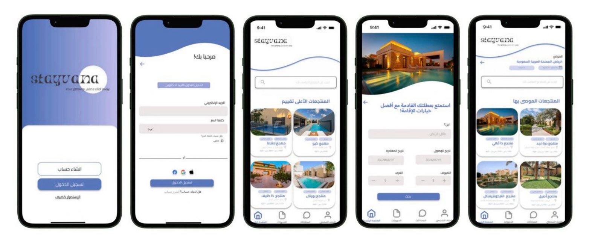
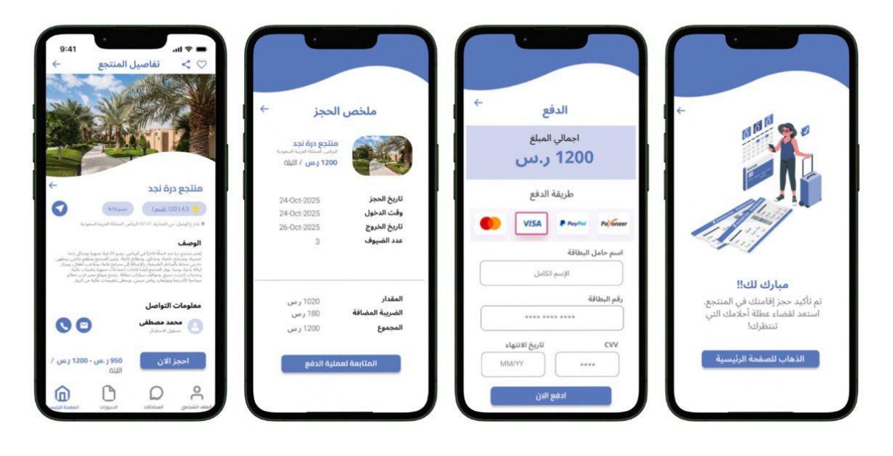
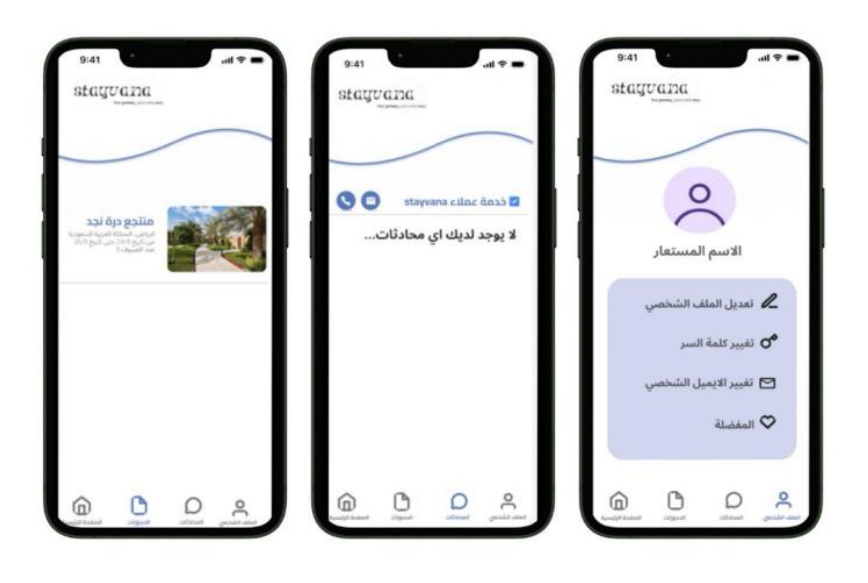

# 🌴 STAYVANA a Resort Booking App (HCI Project)

  

---

## 📌 Abstract
The **Resort Booking App** is a user-centered mobile application designed to simplify the process of finding and reserving resorts and chalets.  
It solves issues like **unclear pricing, unverified reviews, and inefficient communication** with resort owners through:  
- Advanced filtering  
- Verified reviews  
- Real-time messaging  
- Flexible payment methods  

The intuitive interface accommodates users of all ages, ensuring **accessibility, ease of use, and high satisfaction**.

---

## 🎯 Introduction & Objectives
The main goal is to create a **transparent, efficient, and user-friendly** platform for resort bookings.  

**Objectives:**  
1. **Easier Booking** → Simple interface, detailed resort info (pricing, amenities, policies).  
2. **Transparent Reviews** → Only verified guests can review.  
3. **Better Communication** → Real-time messaging between guests & owners.  
4. **Flexible Payments** → Support multiple payment methods, booking modifications.  
5. **Intelligent Discovery** → Advanced filters (cost, region, services).  

---

---

## 🖥️ UI Design & Implementation
Prototype created in **Figma**, focusing on usability and clarity.  

**Main Screens:**  
- **Home Screen** – Search bar, featured resorts, filters (location, price, amenities).  
- **Login & Registration** – Email/social login, validation.  
- **Search Interface** – Location, date, price; sorting by rating, price, location.  
- **Resort Details** – Photos, amenities, room prices, cancellation policies, verified reviews, **Book Now** button.  
- **Booking & Payment** – Guest info, check-in/out, credit card & PayPal flow, confirmation page.  
- **Profile & Settings** – Manage user data, booking history, favorites.  

---

## 📸 Screenshots & Prototype
Here’s a preview of the **UI flow** from the Figma design:  

| Home Screen | Resort Details | Booking Flow |
|-------------|----------------|--------------|
|  |  |  |

---

## 🧪 Testing Procedures
Structured usability testing with **5 participants**, completing **10 key tasks**:  
1. Login  
2. Explore homepage  
3. Search resorts (date/location)  
4. Select resort  
5. View resort details  
6. Initiate booking  
7. Review booking summary  
8. Enter payment info  
9. Confirm booking  
10. Explore other pages  

**Results:**  
- ✅ All tasks completed without errors  
- ⏱️ Avg login = 11s, booking confirmation = 1–6s  
- 🎉 Positive user feedback (easy, clear navigation)  
- 📊 Strong usability & functionality confirmed  

---

## 🚀 Conclusion & Future Improvements
The app successfully **simplifies resort bookings** with transparent pricing, verified reviews, and smooth user interaction.  

**Future Enhancements:**  
- Full backend development  
- AI-based resort recommendations  
- Review validation with photos  
- Social media integration  

---

## 👩‍💻 Work Contributors
- **Anfal Alkuraydis** 
- **Ghaida Al-Anzi** 
- **Rama Al-Otaibi** 
- **Lynn Khashoggi**  
- **Haya Al-Hudayb**   
 

---
